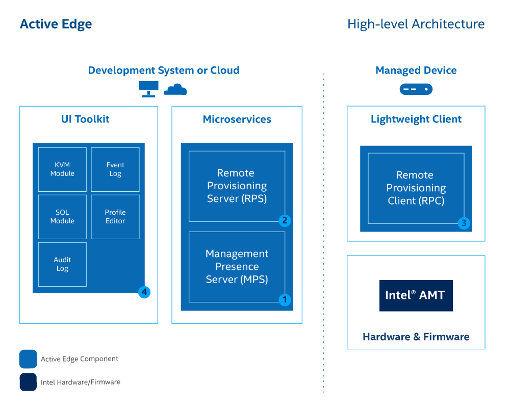

# Active Edge Overview

Intel® vPro™ Platforms offer hardware-enhanced security features and remote manageability, also known as out-of-band manageability, using Intel® Active Management Technology (Intel&reg; AMT). With Intel&reg; AMT, administrators remotely manage, repair, and update network assets, such as systems and edge devices. In the event that a network asset is powered off or the operating system is unavailable, administrators can power on the asset. 

Active Edge provides open-source, modular microservices and libraries for integration of hardware provisioning, out-of-band manageability, and other Intel&reg; AMT features with both new and existing management consoles, software solutions, and more. As an open source implementation, Active Edge makes it easier for IT departments and ISVs to adopt, integrate, and customize out-of-band management solutions for Intel® vPro™ Platforms.

Read more about Intel&reg; AMT features and capabilities [here](https://software.intel.com/content/www/us/en/develop/topics/iot/hardware/vpro-platform-retail.html).

## Goals

The Active Edge guides provides instructions to:

- Deploy the Management Presence Server (MPS) and Remote Provisioning Server (RPS) on the development system.
- Build and run Remote Provisioning client (RPC) on the managed device.
- Connect the managed device (edge device)

Additional sections provide guidance on the reference implementation UI Toolkit, REST API usage, asset security, and more.

**Figure 1: Active Edge High-level Architecture**

As shown in Figure 1, Active Edge high-level architecture consists of four components:

1. **MPS** - A microservice that utilizes an Intel vPro&reg; feature, Client Initiated Remote Access (CIRA), for enabling edge, cloud devices to maintain a persistent connection for out-of-band manageability features, such as power control or KVM control.
2. **RPS** - A microservice that activates Intel&reg; AMT-based platforms using pre-defined profiles and connects them to the MPS for manageability use cases.
3. **RPC** - A lightweight client application that communicates with the RPS server to activate Intel&reg; AMT.
4. **UI Toolkit** - A Toolkit that includes prebuilt React components and a reference implementation web console. The React-based snippets simplify the task of adding complex manageability-related UI controls, such as the Keyboard, Video, Mouse (KVM), to a console.

## Active Edge Setup

### Build and Deploy Microservices Locally
If unfamiliar with Docker, choose this setup option to accomplish a manual, local installation of microservices. 

[Get Started with Local Microservices](Local/overview.md){: .md-button .md-button--primary }

Estimated completion time: **Approximately 15 minutes**

### Build and Deploy Microservices with Local Docker* Images

If familiar with Docker, choose this setup option to install microservices as local Docker images. This option is an especially good choice for development systems with Docker already installed.

[Get Started with Microservices as Docker Images](Docker/overview.md){: .md-button .md-button--primary }

Estimated completion time: **Approximately 15 minutes**

Both build-and-deploy options install microservices locally on a development system. The client application is installed on a managed device. Experienced Docker users may choose to deploy microservices straight to the [cloud](Docker/dockerCloud.md).
 
-------
## Additional Intel® AMT Resources

For additional information about Intel® AMT, see the following links:

- [Intel® vPro Overview](https://software.intel.com/content/www/us/en/develop/topics/iot/hardware/vpro-platform-retail.html)
- [Video Link](https://www.intel.com/content/www/us/en/support/articles/000026592/technologies.html)
- [Detailed Setup document](https://software.intel.com/en-us/articles/getting-started-with-intel-active-management-technology-amt)

